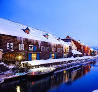
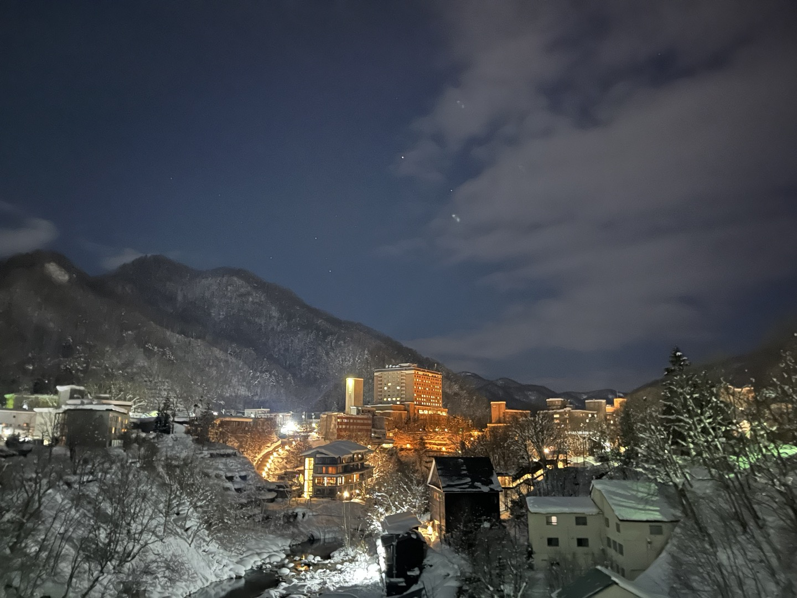
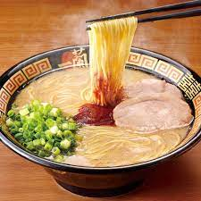

## 📍 일본 - 홋카이도(삿포로)

  
 >삿포로는 일본에서도 다섯번째로 인구가 많은 삿포로시는 홋카이도의 정치・경제의 중심적 도시입니다. 189만 명의 인구를 가지고 있으면서 잘 정비된 도시기능과 풍요로운 자연이 잘 조화를 이룬 경관은 대도시이면서 개방적인 분위기가 넘쳐나고 있습니다. 백화점과 지하철, 대형상업시설 등 쇼핑공간도 충분합니다. 삿포로의 겨울은 이미 전세계적으로 유명하며, 조잔케이는 장난없습니다.
  🎿
  ###  주요 관광지 
   
  #### 조잔케이 근처의 료칸들
  
    
    료칸이란 ❓   
    ✔  료칸(旅館, 여관)은 일본의 전통적인 여객 및 숙박 시설을 가리킵니다.

🚩한국에서는 '여관'이 숙박시설 가운데서도 다소 낙후되고 저렴한 업소(여인숙)를 지칭하는 어휘로 쓰이지만 , 일본의 료칸은 서양의 호텔이나 펜션에 대응하는 일본식 고급 숙박 시설의 이미지가 강합니다. 

료칸은 일본의 전통 주택인 고민가와 화실(和室) 공간을 제공하며, 고급 일식 코스요리인 가이세키(懐石) 요리와 온천욕을 즐길 수 있는 욕장 등이 딸려 있는 것이 일반적이고, 비용에 따라 객실 내에 노천탕이 존재하는 경우도 있습니다. 이러한 인식의 차이로 료칸은 일종의 고유명사화되어 일본식 한자 독음 그대로 부르는 경우가 많습니다.

   ### 여행지 주요 맛집
   
   #### 이치란 라멘
  

   일본의 유명한 라멘 체인점인데, 식상하다고 생각하실 수 있겠지만, 돈코츠라멘이 진짜 맛있습니다. 일본여행을 갔을 때, 진짜 거의 하루에 한번은 꼭 먹으러 간 곳입니다. 구글링해서 갔던 다른곳들은 가면 주변 손님들이 전부다 한국말하는 사람들 밖에 없는데 여긴 달랐습니다... 모두가 꼭 드셔봤으면 좋겠습니다. 

  
