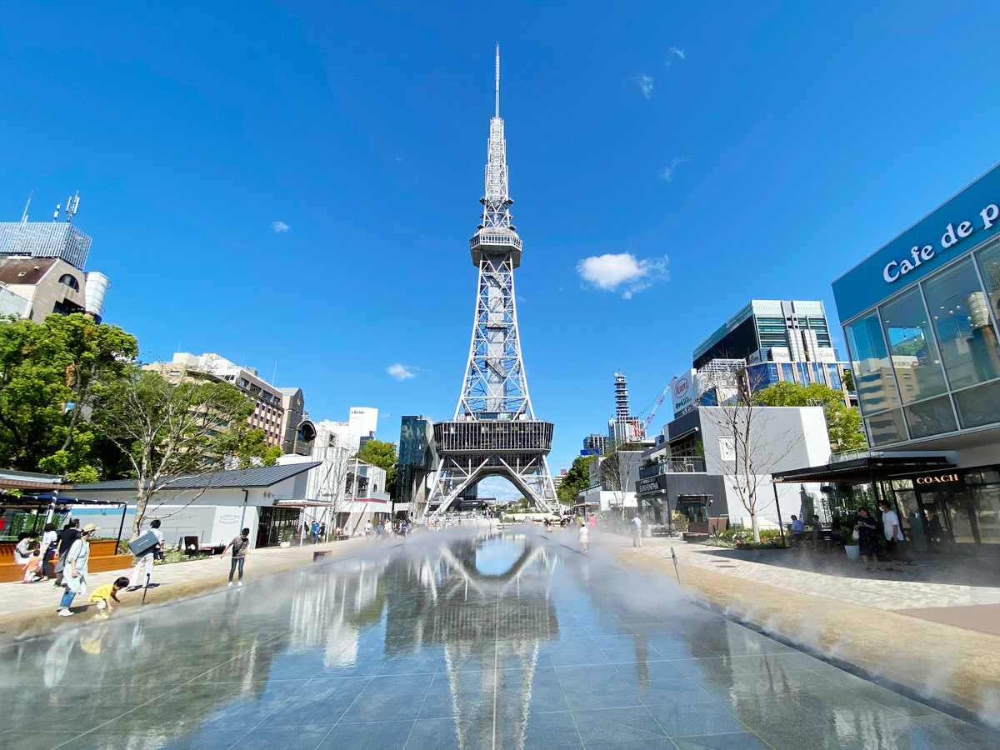
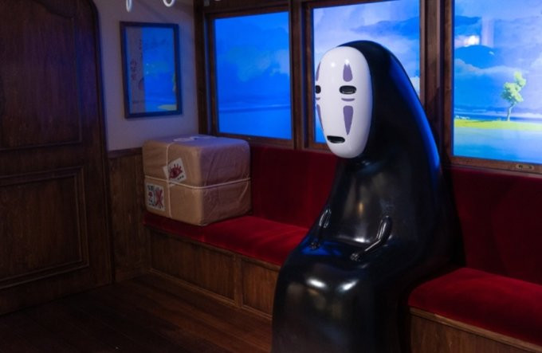
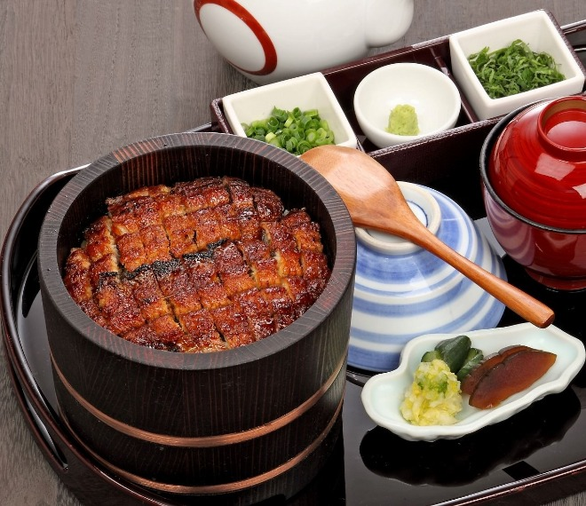

# 일본 - 나고야

이미지는 나고야의 대표 전망대인 나고야TV타워이다  

## 나고야 소개
일본에서 4번째로 인구가 많은 도시이며, 인구는 약 230만명이다  
공항에서 시내까지는 기차 24분, 지하철 47분이 소요된다  
타카야마, 히다쿠루카와, 게로 등 주변 관광지들과 가깝다

## 관광지 (지브리파크)
  

2022년에 완공된 테마파크로 지브리 영화에   
등장한 캐릭터 및 배경을 그대로 재현해 놓았다

대부분의 작품 테마가 실물 크기로 전시되어 있다

현재 계속해서 테마구역이 추가 되고 있으며  
24년에는 하울의 움직이는 성과 마녀배달부 키키  
테마구역이 추가될 예정이다

## 음식 (히츠마부시)

일본에서 장어 덮밥은 크게 두 종류가 있으며  

나고야식의 히츠마부시(원형그릇)와   
교토식의 우나쥬(사각그릇)로 구분된다

### 히츠마부시는 먹는 방법이 따로 있다  
STEP1. 덮밥의 내용물을 4분할 한다  
STEP2. 장어와 밥을 작은 그릇에 옮겨 담는다  
STEP3. 약미와 장어, 밥을 섞어서 먹는다  
STEP4. 차, 혹은 다시(ダシ:우린 국물)과 함께 먹는다  
STEP5. 마지막은 좋아하는 방법으로 먹는다.  

  
    
### 홈으로 이동하기
[readme로 이동](../README.md)
